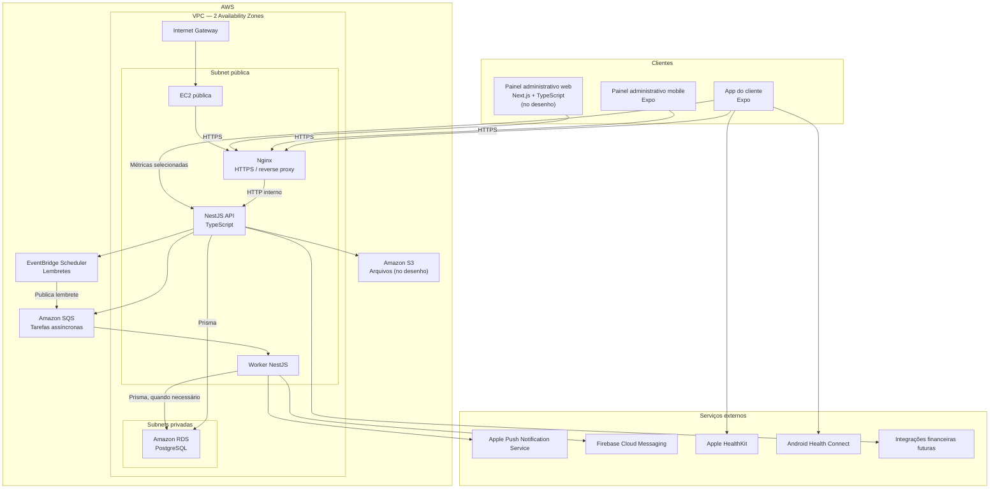

# Arquitetura geral

## Objetivo

Criar um app próprio para uma academia de aulas personalizadas, substituindo o white-label atual e permitindo evolução gradual para novas funcionalidades, integrações e gamificação.

A primeira versão atende uma única filial, com poucos clientes e sem vendas dentro do app. A estrutura deve permitir crescimento posterior sem introduzir complexidade operacional desnecessária desde o início.

## Diagrama de componentes



## Responsabilidades dos componentes

### App mobile

Aplicativo Expo para clientes. Também é a base prevista para o painel administrativo mobile.

Responsabilidades de alto nível:

- exibir agenda, aulas, planos, histórico e perfil;
- solicitar reservas, cancelamentos e remarcações;
- receber notificações;
- solicitar biometria local;
- acessar HealthKit ou Health Connect com consentimento;
- sincronizar somente as métricas de saúde definidas pelo produto.

O app não é autoridade para disponibilidade de vagas, permissões ou confirmação de reserva.

### Painéis administrativos

O painel web e o painel mobile administrativo atendem professores e funcionários, com diferenciação de acesso.

O painel administra, em alto nível:

- agenda e aulas;
- clientes;
- planos;
- reservas e remarcações;
- presença;
- notificações;
- integrações e informações financeiras;
- gamificação, quando entrar no escopo.

A divisão exata entre painel web e mobile ainda está pendente.

### Nginx

Fica na EC2 pública, recebe tráfego HTTPS e encaminha as requisições para a API NestJS em uma porta interna. O NestJS não fica diretamente exposto à internet.

### NestJS API

É a autoridade da aplicação. Centraliza autenticação, autorização, validações, regras de agenda, operações de reserva, integrações e acesso aos dados por Prisma.

### Worker NestJS

Processa tarefas assíncronas recebidas da SQS. Inicialmente roda na mesma EC2, separado logicamente da API.

Casos previstos:

- envio de push;
- processamento de lembretes;
- sincronizações externas;
- importações e automações futuras.

### RDS PostgreSQL

Armazena os dados oficiais da aplicação. O RDS fica privado e só aceita acesso da aplicação na rede AWS.

### SQS

Transporta tarefas assíncronas. A fila não confirma reservas e não é a fonte oficial da disponibilidade de aulas.

### EventBridge Scheduler

Agenda disparos futuros, principalmente lembretes de aulas. Quando chega o horário, publica uma tarefa na SQS.

### S3

Componente previsto para arquivos, como imagens, documentos e relatórios. Não substitui o PostgreSQL para dados relacionais.

### Serviços externos

- FCM e APNs: entrega de push para Android e iOS.
- HealthKit: acesso a dados de saúde no ecossistema Apple.
- Health Connect: acesso a dados de saúde no ecossistema Android.
- Sistemas financeiros: integração futura para consultar ou automatizar informações, sem vendas dentro do app.

## Topologia AWS inicial

```text
VPC com 2 Availability Zones
├── Subnet pública
│   └── EC2 pública
│       ├── Nginx
│       ├── NestJS API
│       └── Worker NestJS
├── Subnet privada na AZ A
└── Subnet privada na AZ B
    └── RDS PostgreSQL privado

Internet Gateway
Sem NAT Gateway inicialmente
Sem Load Balancer inicialmente
```

O desenho de duas Availability Zones prepara o RDS para maior resiliência futura. A aplicação começa com uma EC2, portanto a EC2 continua sendo um ponto único de falha na primeira versão.

## Limites do desenho atual

Este documento não define ainda:

- esquema de tabelas ou entidades;
- padrão de código;
- estilo de API;
- ciclo de vida detalhado dos tokens;
- configuração fina de IAM e Security Groups;
- domínio e certificados;
- pipeline de deploy;
- estratégia de alta disponibilidade;
- cache;
- observabilidade;
- detalhes de integração com cada wearable.
