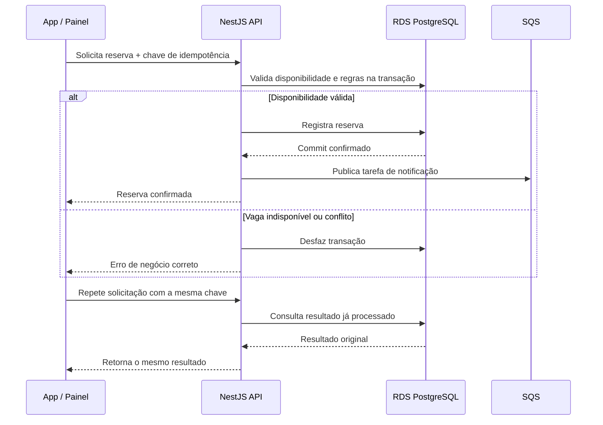

# Operação crítica: reserva de aula

## Princípio

A disponibilidade exibida no app ou painel é apenas uma leitura informativa. A decisão de confirmar uma reserva pertence ao backend e precisa considerar o estado atual da agenda.

## Diagrama de alto nível



## Regras aprovadas

1. O frontend não confirma reserva.
2. O backend revalida a disponibilidade.
3. A confirmação e a atualização necessária acontecem na mesma operação transacional.
4. A mesma intenção repetida não cria uma segunda reserva.
5. Estado desatualizado retorna erro específico, e não sucesso falso.
6. A notificação só é enfileirada depois do commit da reserva.
7. Falha no worker ou no provedor de push não desfaz a reserva confirmada.
8. A fila processa efeitos posteriores; não decide disponibilidade.

## Resultado esperado para o cliente

Exemplos de códigos de negócio:

```text
CLASS_FULL
SCHEDULE_CONFLICT
BOOKING_WINDOW_CLOSED
PLAN_NOT_ELIGIBLE
DUPLICATE_REQUEST
```

Para vaga esgotada ou conflito de agenda, a API deve usar um erro HTTP de conflito, como `409 Conflict`, com código de negócio que permita ao app atualizar a tela e mostrar a causa correta.

Exemplo conceitual:

```json
{
  "code": "CLASS_FULL",
  "message": "A aula não possui mais vagas.",
  "currentAvailableSpots": 0
}
```

## Limites deste documento

Este documento não escolhe schema, índices, locks, nível de isolamento, estratégia de retry ou implementação específica do Prisma. Esses detalhes serão definidos quando a camada de dados for modelada.
